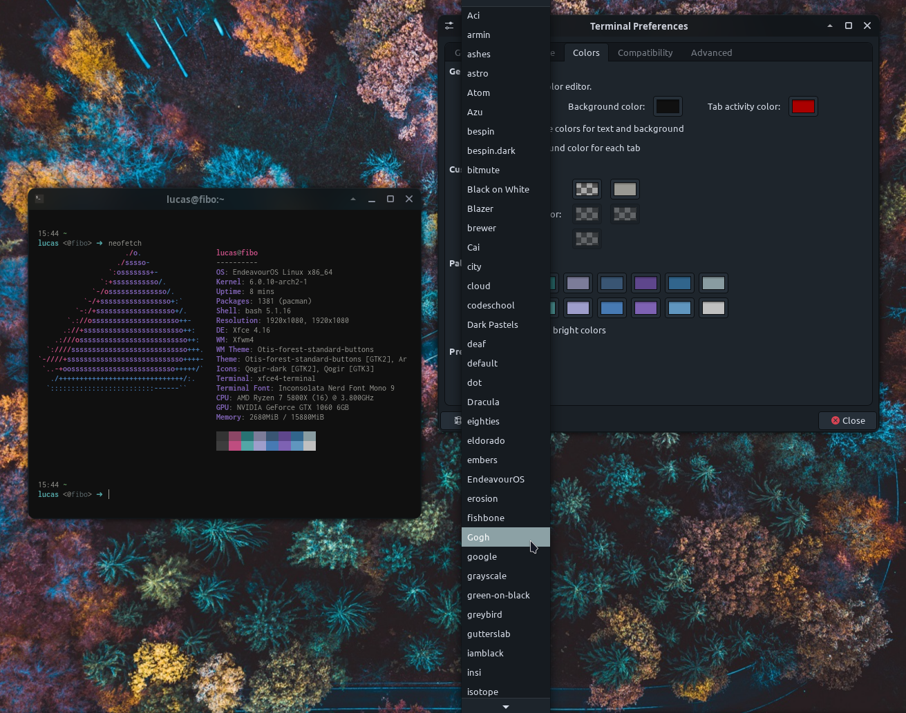
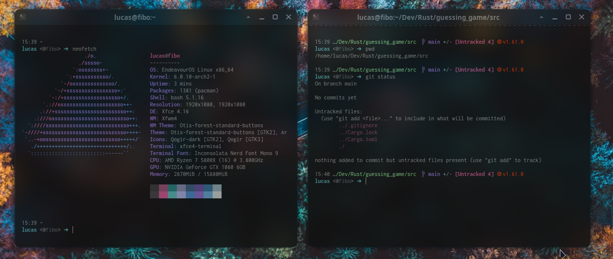

# My Dotfiles

A repo to keep my dotfiles, aiding deployment and provisioning.

## Themes

#### XFCE4 Terminal

- XFCE4 terminal colorschemes in `~/.local/share/xfce4/terminal/colorschemes`.

#### Starship Prompt

- My starship terminal prompt config in `~/.config/starship.toml`. 

## Apps and scripts

#### Neovim

- Download vim plugins manager with: `curl -fLo ~/.vim/autoload/plug.vim --create-dirs https://raw.githubusercontent.com/junegunn/vim-plug/master/plug.vim`
- add the following lines to `~/.config/nvim/init.vim` to share code between vim and nvim:

```
set runtimepath^=~/.vim runtimepath+=~/.vim/after
let &packpath=&runtimepath
source ~/.vimrc
```

- Set an alias for nvim in your `.bashrc`:

```
alias vim="nvim"
```

- `.vimrc.plug` lives with `.vimrc` in home dir, it manages the vim plugins.

- There's also a `skeleton.py` file to boilerplate new python scripts.

#### Devour

Devour hides the terminal window before launching an external program, and unhides it after quitting.

- Enter devour directory and follow instructions in the `README.md` file.

#### Huion tablet

- A script that allows me to use a Huion tablet with Linux, located in `~/bin/huion.sh`.

## TODO

- build and install script/makefile
