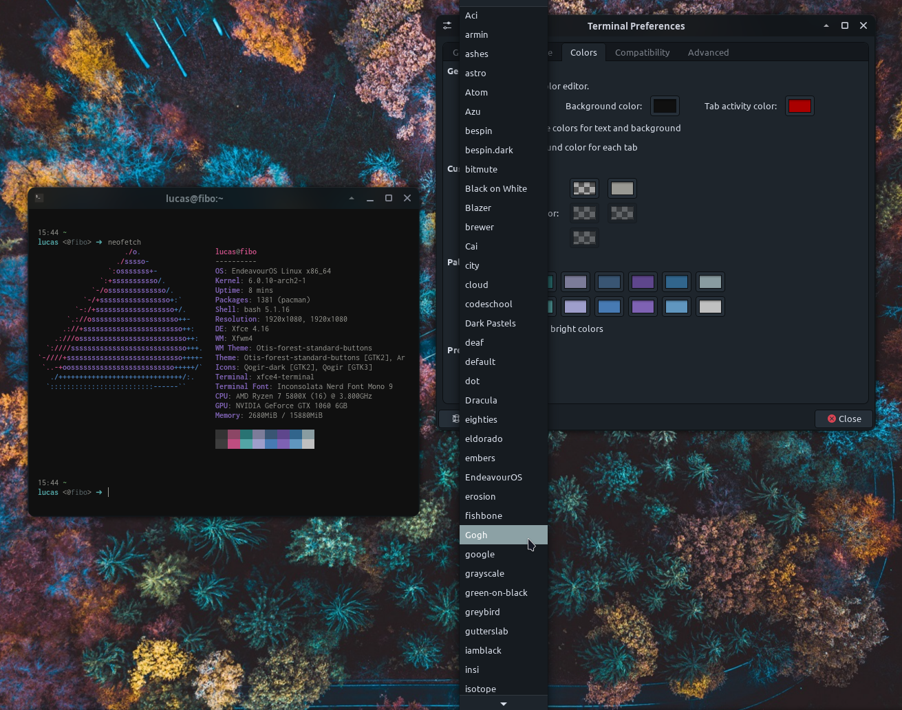
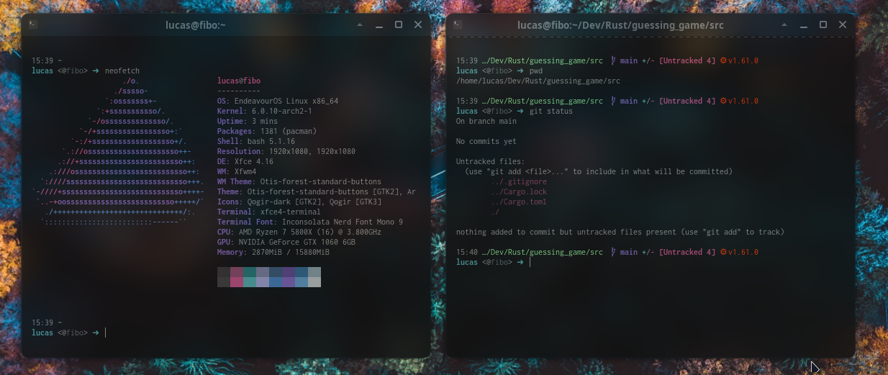

# Linux Dotfiles
This repository contains my dotfiles for Linux (tested only on Debian, base.sh will need adjustments to work with other package managers), providing a streamlined setup and configuration process.

## Installation
To set up your environment, run the installation script. Clone the repository and execute the following commands:

```console
git clone git@github.com:LucasRochaAbraao/dotfiles.git
cd dotfiles
./install_dotfiles.sh
```

## script will automatically install and configure the following:

- xfce4-terminal color schemes: 

- Starship prompt: 

- xfce4 themes: Desktop and windows themes

- Neovim

- Wallpapers

- Huion Tablet: A script that sets the active monitor when using a Huion tablet with Linux.
